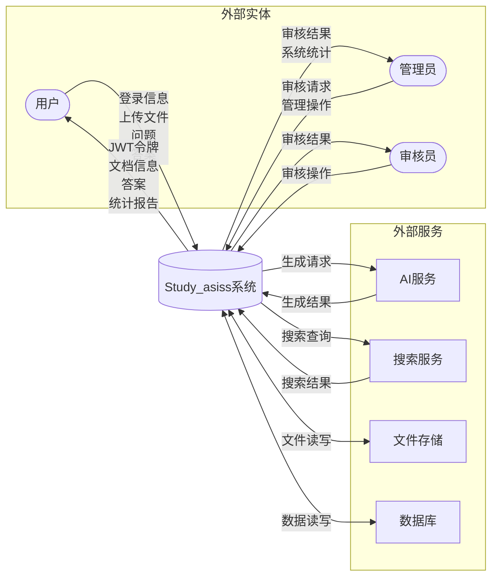

# Study_asiss 系统 - 零层DFD

```mermaid
flowchart LR
    subgraph EE["外部实体"]
        U(["用户"])
        A(["管理员"])
        Au(["审核员"])
    end

    S[("Study_asiss系统")]

    subgraph ES["外部服务"]
        AI["AI服务"]
        Se["搜索服务"]
        F["文件存储"]
        DB["数据库"]
    end

    U -->|"登录信息<br/>上传文件<br/>问题<br/>答案"| S
    S -->|"JWT令牌<br/>文档信息<br/>答案<br/>统计报告"| U

    A -->|"审核请求<br/>管理操作"| S
    S -->|"审核结果<br/>系统统计"| A

    Au -->|"审核操作"| S
    S -->|"审核结果"| Au

    S -->|"生成请求"| AI
    AI -->|"生成结果"| S

    S -->|"搜索查询"| Se
    Se -->|"搜索结果"| S

    S <--> |"文件读写"| F
    S <--> |"数据读写"| DB
```
