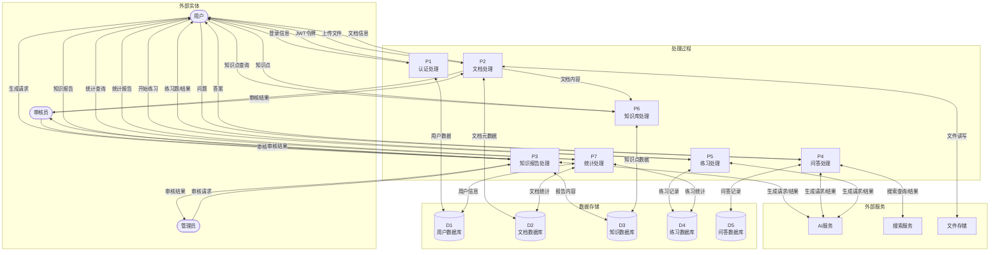

# Study_asiss 系统 - 一层DFD

```mermaid
flowchart TB
    subgraph EE["外部实体"]
        U(["用户"])
        A(["管理员"])
        Au(["审核员"])
    end

    subgraph EX["外部服务"]
        AI["AI服务"]
        Se["搜索服务"]
        FS["文件存储"]
    end

    subgraph DS["数据存储"]
        D1[("D1<br/>用户数据库")]
        D2[("D2<br/>文档数据库")]
        D3[("D3<br/>知识数据库")]
        D4[("D4<br/>练习数据库")]
        D5[("D5<br/>问答数据库")]
    end

    subgraph P["处理过程"]
        P1["P1<br/>认证处理"]
        P2["P2<br/>文档处理"]
        P3["P3<br/>知识报告处理"]
        P4["P4<br/>问答处理"]
        P5["P5<br/>练习处理"]
        P6["P6<br/>知识库处理"]
        P7["P7<br/>统计处理"]
    end

    U -->|"登录信息"| P1
    P1 -->|"JWT令牌"| U
    P1 <--> |"用户数据"| D1

    U -->|"上传文件"| P2
    P2 -->|"文档信息"| U
    P2 <--> |"文档元数据"| D2
    P2 <--> |"文件读写"| FS

    U -->|"生成请求"| P3
    P3 -->|"知识报告"| U
    P3 <--> |"报告内容"| D3
    P3 <--> |"生成请求/结果"| AI

    U -->|"问题"| P4
    P4 -->|"答案"| U
    P4 <--> |"问答记录"| D5
    P4 <--> |"生成请求/结果"| AI
    P4 <--> |"搜索查询/结果"| Se

    U -->|"开始练习"| P5
    P5 -->|"练习题/结果"| U
    P5 <--> |"练习记录"| D4
    P5 <--> |"生成请求/结果"| AI

    U -->|"知识点查询"| P6
    P6 -->|"知识点"| U
    P6 <--> |"知识点数据"| D3

    U -->|"统计查询"| P7
    P7 -->|"统计报告"| U
    P7 <--> |"用户信息"| D1
    P7 <--> |"文档统计"| D2
    P7 <--> |"练习统计"| D4

    A -->|"审核请求"| P3
    P3 -->|"审核结果"| A

    Au -->|"审核请求"| P2
    P2 -->|"审核结果"| Au

    Au -->|"审核请求"| P3
    P3 -->|"审核结果"| Au

    P2 -->|"文档内容"| P6
```
