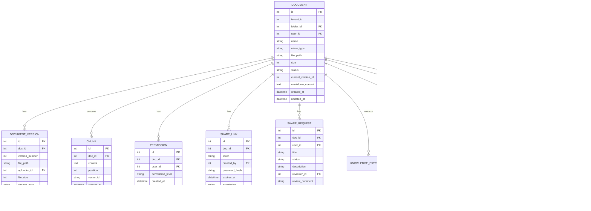
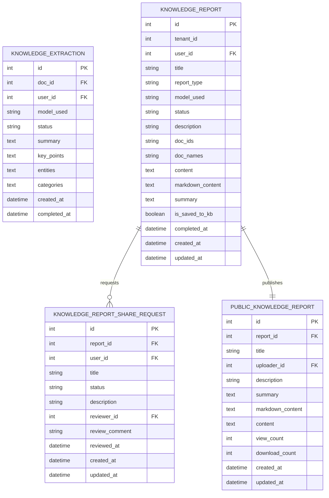
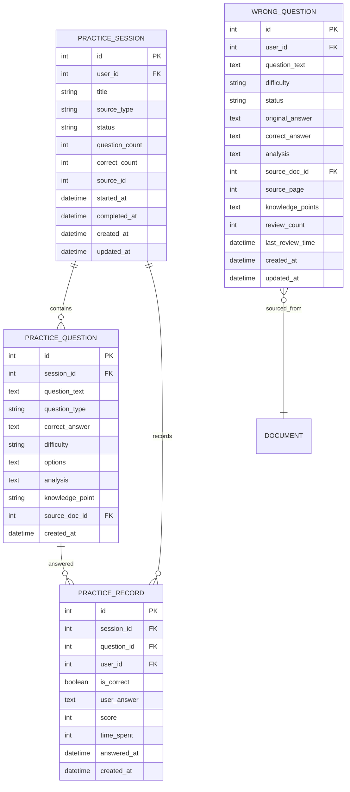
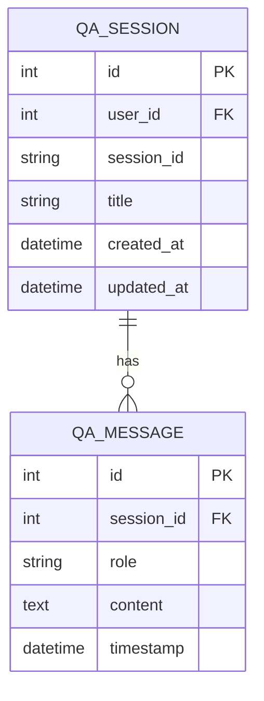
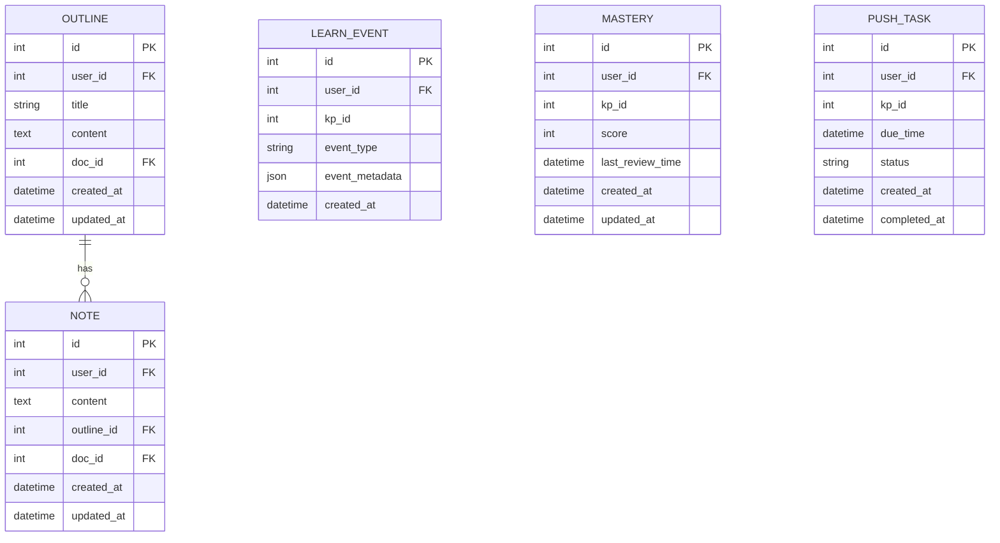

# Study_asiss 系统 - ER图

## 用户管理

```mermaid
erDiagram
    USER ||--o{ DOCUMENT : uploads
    USER ||--o{ KNOWLEDGE_REPORT : generates
    USER ||--o{ PRACTICE_SESSION : creates
    USER ||--o{ WRONG_QUESTION : has
    USER ||--o{ QA_SESSION : starts
    USER ||--o{ OUTLINE : creates
    USER ||--o{ NOTE : writes
    USER ||--o{ LEARN_EVENT : triggers
    USER ||--o{ MASTERY : owns
    USER ||--o{ PUSH_TASK : receives
    USER ||--o{ KNOWLEDGE_REPORT_SHARE_REQUEST : reviews
    USER ||--o{ SHARE_REQUEST : reviews
    USER ||--o{ DOCUMENT_VERSION : uploads

    USER {
        int id PK
        string username
        string password_hash
        string email
        string role
        int tenant_id
        datetime created_at
        datetime updated_at
    }

    FOLDER ||--o{ FOLDER : contains
    FOLDER ||--o{ DOCUMENT : has

    FOLDER {
        int id PK
        int tenant_id
        string name
        int parent_id FK
        int sort_order
        datetime created_at
        datetime updated_at
    }

    TAG ||--o{ DOCUMENT_TAGS : tagged

    TAG {
        int id PK
        int tenant_id
        string name
        string color
        datetime created_at
    }

    KNOWLEDGE_POINT ||--o{ KNOWLEDGE_POINT : contains

    KNOWLEDGE_POINT {
        int id PK
        string name
        int parent_id FK
        string description
        string category
        datetime created_at
        datetime updated_at
    }
```

## 文档管理

```mermaid
erDiagram
    DOCUMENT ||--o{ DOCUMENT_VERSION : has
    DOCUMENT ||--o{ CHUNK : contains
    DOCUMENT ||--o{ PERMISSION : has
    DOCUMENT ||--o{ SHARE_LINK : has
    DOCUMENT ||--o{ SHARE_REQUEST : has
    DOCUMENT ||--o{ KNOWLEDGE_EXTRACTION : extracts
    DOCUMENT ||--|| PUBLIC_DOCUMENT : publishes
    DOCUMENT ||--o{ PRACTICE_QUESTION : sources
    DOCUMENT ||--o{ DOCUMENT_TAGS : tags

    DOCUMENT {
        int id PK
        int tenant_id
        int folder_id FK
        int user_id FK
        string name
        string mime_type
        string file_path
        int size
        string status
        int current_version_id
        text markdown_content
        datetime created_at
        datetime updated_at
    }

    DOCUMENT_VERSION {
        int id PK
        int doc_id FK
        int version_number
        string file_path
        int uploader_id FK
        int file_size
        string change_note
        datetime created_at
    }

    CHUNK {
        int id PK
        int doc_id FK
        text content
        int position
        string vector_id
        datetime created_at
    }

    PERMISSION {
        int id PK
        int doc_id FK
        int user_id FK
        string permission_level
        datetime created_at
    }

    SHARE_LINK {
        int id PK
        int doc_id FK
        string token
        int created_by FK
        string password_hash
        datetime expires_at
        string permission
        datetime created_at
    }

    SHARE_REQUEST {
        int id PK
        int doc_id FK
        int user_id FK
        string title
        string status
        string description
        int reviewer_id FK
        string review_comment
        datetime reviewed_at
        datetime created_at
        datetime updated_at
    }

    PUBLIC_DOCUMENT {
        int id PK
        int doc_id FK
        string title
        int uploader_id FK
        string description
        text extracted_knowledge
        int view_count
        int download_count
        datetime created_at
        datetime updated_at
    }

    DOCUMENT_TAGS {
        int doc_id FK
        int tag_id FK
    }
```

## 知识报告

```mermaid
erDiagram
    KNOWLEDGE_EXTRACTION {
        int id PK
        int doc_id FK
        int user_id FK
        string model_used
        string status
        text summary
        text key_points
        text entities
        text categories
        datetime created_at
        datetime completed_at
    }

    KNOWLEDGE_REPORT ||--o{ KNOWLEDGE_REPORT_SHARE_REQUEST : requests
    KNOWLEDGE_REPORT ||--|| PUBLIC_KNOWLEDGE_REPORT : publishes

    KNOWLEDGE_REPORT {
        int id PK
        int tenant_id
        int user_id FK
        string title
        string report_type
        string model_used
        string status
        string description
        string doc_ids
        string doc_names
        text content
        text markdown_content
        text summary
        boolean is_saved_to_kb
        datetime completed_at
        datetime created_at
        datetime updated_at
    }

    KNOWLEDGE_REPORT_SHARE_REQUEST {
        int id PK
        int report_id FK
        int user_id FK
        string title
        string status
        string description
        int reviewer_id FK
        string review_comment
        datetime reviewed_at
        datetime created_at
        datetime updated_at
    }

    PUBLIC_KNOWLEDGE_REPORT {
        int id PK
        int report_id FK
        string title
        int uploader_id FK
        string description
        text summary
        text markdown_content
        text content
        int view_count
        int download_count
        datetime created_at
        datetime updated_at
    }
```

## 练习系统

```mermaid
erDiagram
    PRACTICE_SESSION ||--o{ PRACTICE_QUESTION : contains
    PRACTICE_SESSION ||--o{ PRACTICE_RECORD : records
    PRACTICE_QUESTION ||--o{ PRACTICE_RECORD : answered
    WRONG_QUESTION }o--|| DOCUMENT : sourced_from

    PRACTICE_SESSION {
        int id PK
        int user_id FK
        string title
        string source_type
        string status
        int question_count
        int correct_count
        int source_id
        datetime started_at
        datetime completed_at
        datetime created_at
        datetime updated_at
    }

    PRACTICE_QUESTION {
        int id PK
        int session_id FK
        text question_text
        string question_type
        text correct_answer
        string difficulty
        text options
        text analysis
        string knowledge_point
        int source_doc_id FK
        datetime created_at
    }

    PRACTICE_RECORD {
        int id PK
        int session_id FK
        int question_id FK
        int user_id FK
        boolean is_correct
        text user_answer
        int score
        int time_spent
        datetime answered_at
        datetime created_at
    }

    WRONG_QUESTION {
        int id PK
        int user_id FK
        text question_text
        string difficulty
        string status
        text original_answer
        text correct_answer
        text analysis
        int source_doc_id FK
        int source_page
        text knowledge_points
        int review_count
        datetime last_review_time
        datetime created_at
        datetime updated_at
    }
```

## 问答系统

```mermaid
erDiagram
    QA_SESSION ||--o{ QA_MESSAGE : has

    QA_SESSION {
        int id PK
        int user_id FK
        string session_id
        string title
        datetime created_at
        datetime updated_at
    }

    QA_MESSAGE {
        int id PK
        int session_id FK
        string role
        text content
        datetime timestamp
    }
```

## 学习管理

```mermaid
erDiagram
    OUTLINE ||--o{ NOTE : has

    OUTLINE {
        int id PK
        int user_id FK
        string title
        text content
        int doc_id FK
        datetime created_at
        datetime updated_at
    }

    NOTE {
        int id PK
        int user_id FK
        text content
        int outline_id FK
        int doc_id FK
        datetime created_at
        datetime updated_at
    }

    LEARN_EVENT {
        int id PK
        int user_id FK
        int kp_id
        string event_type
        json event_metadata
        datetime created_at
    }

    MASTERY {
        int id PK
        int user_id FK
        int kp_id
        int score
        datetime last_review_time
        datetime created_at
        datetime updated_at
    }

    PUSH_TASK {
        int id PK
        int user_id FK
        int kp_id
        datetime due_time
        string status
        datetime created_at
        datetime completed_at
    }
```
