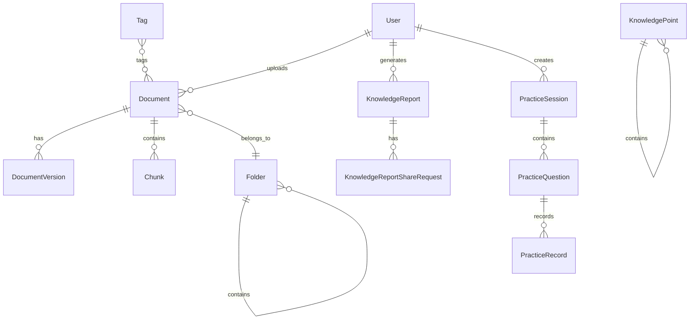
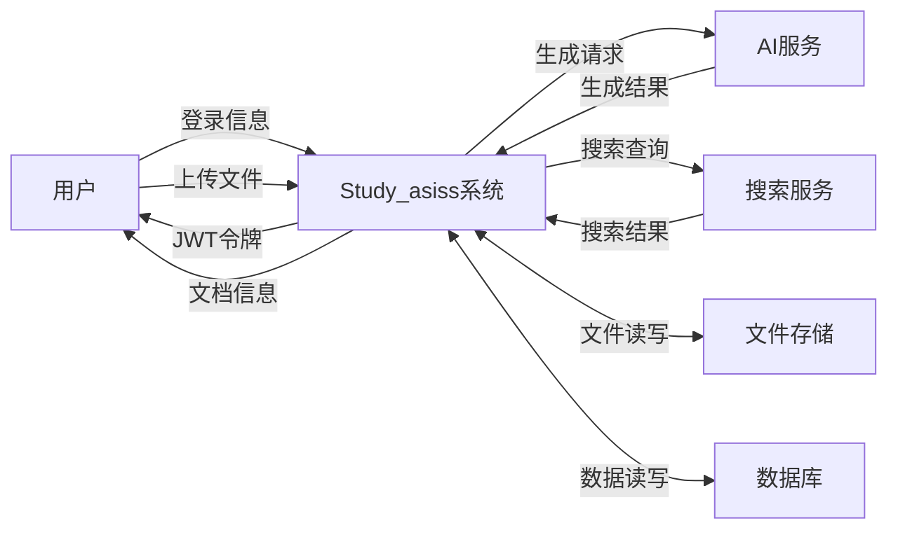
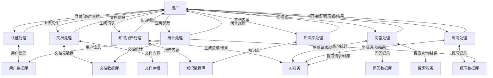

# Study_asiss 项目绘图提示词说明

本目录包含用于生成Study_asiss项目ER图和DFD图的提示词。

## 文件列表

### 1. er_diagram_prompt.md
**用途**：绘制实体关系图（ER Diagram）

**包含内容**：
- 项目背景介绍
- 27个数据模型的详细说明
  - 实体属性
  - 主键/外键关系
  - 约束条件
  - 实体间关系（1:1、1:N、N:M）
- 绘制要求
- 输出格式说明

**适用工具**：
- Mermaid ER Diagram
- draw.io
- Lucidchart
- 其他专业ER图工具

### 2. dfd_prompt.md
**用途**：绘制数据流图（Data Flow Diagram）

**包含内容**：
- 项目背景介绍
- 7个功能模块详细说明
  - 用户认证与授权
  - 文档管理
  - 知识报告生成
  - 智能问答
  - 练习题生成
  - 知识库管理
  - 学习统计
- 外部实体定义
- 零层DFD（Context Diagram）绘制要求
- 一层DFD（Level-1 DFD）绘制要求
- 绘制规范和符号说明

**适用工具**：
- Mermaid DFD
- draw.io
- Lucidchart
- 其他专业DFD工具

## 使用方法

### 使用Mermaid绘制

#### ER图

#### 零层DFD

#### 一层DFD

### 使用draw.io绘制

1. 打开 [draw.io](https://app.diagrams.net/)
2. 选择"ER Diagram"或"Flowchart"模板
3. 根据提示词中的详细说明绘制图表
4. 导出为PNG、SVG或PDF格式

### 使用Lucidchart绘制

1. 打开 [Lucidchart](https://www.lucidchart.com/)
2. 创建新图表，选择ER图或DFD模板
3. 根据提示词中的详细说明绘制图表
4. 导出为所需格式

## 注意事项

### ER图绘制
1. 所有表的主键都是UUID字符串类型
2. 所有时间字段使用DateTime类型
3. JSON字段用于存储复杂数据结构
4. 自关联关系需要明确标注（如Folder和KnowledgePoint）
5. 多对多关系需要通过中间表实现（如document_tags）
6. 唯一约束需要在图中标注

### DFD绘制
1. 零层DFD展示系统与外部实体的交互
2. 一层DFD展示系统内部的主要处理过程
3. 数据流需要标注清晰的数据内容
4. 处理过程需要编号（P1、P2、P3...）
5. 数据存储需要编号（D1、D2、D3...）
6. 外部实体需要编号（E1、E2、E3...）
7. 保持数据流的平衡性
8. 避免数据流交叉和混乱

## 输出建议

### ER图建议输出
1. **完整ER图**：包含所有27个实体及其关系
2. **模块化ER图**：按功能模块分组绘制
   - 用户管理模块
   - 文档管理模块
   - 知识报告模块
   - 练习模块
   - 问答模块

### DFD建议输出
1. **零层DFD**：展示系统整体交互
2. **一层DFD**：展示7个主要处理过程
3. **可选：二层DFD**：展示关键处理过程的细节

## 项目架构参考

详细的技术架构和实现逻辑请参考：
- 技术架构文档：`../../tecdocu/tec.md`
- 系统架构文档：`../../specs/sys_Arch.md`

## 联系方式

如有疑问或需要补充说明，请联系项目维护者。