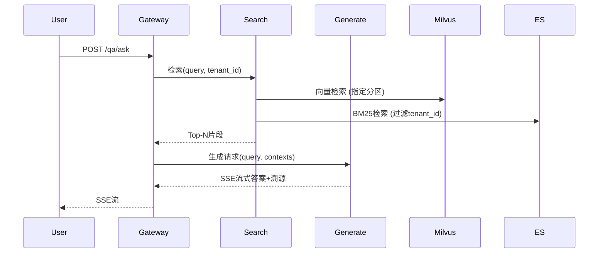

# Spec 3.1（修订版）：系统总体架构设计规格  
（适配混合部署模式：关键数据服务裸机/VM + 无状态服务容器化）

## 1. 目标
设计一套云原生与裸机/VM 混合部署、可扩展、安全的多租户智能学习助手系统架构。系统集成多格式文档解析、向量化存储、混合语义检索、大模型约束生成、学习行为分析等能力，支持 Web/App/小程序多端同步。针对数据库、搜索引擎和消息队列等有状态关键服务采用裸机或虚拟机部署以保证高可见性和数据持久性，无状态业务服务容器化以实现弹性伸缩。

## 2. 功能需求
- 多格式文档摄入与异步处理流水线
- 高性能向量存储与混合检索引擎
- 严格防幻觉的RAG生成服务
- 用户知识库目录、标签、权限、版本管理
- 学习行为追踪与智能复盘分析
- 后台审核、配置优化与系统监控
- 多端同步与离线缓存支持

## 3. 设计细节

### 3.1 部署模式与微服务拆分
系统采用**混合部署模式**：关键有状态组件部署于裸机或虚拟机，无状态业务服务运行于 Kubernetes 容器平台。

| 服务/组件 | 部署方式 | 说明 |
|-----------|----------|------|
| **Milvus** | 裸机/VM 集群 | 向量数据库，需高性能存储与网络，容器化可能引入性能抖动，部署在物理机或专用 VM 上保证稳定性 |
| **Elasticsearch** | 裸机/VM 集群 | 全文检索，同样追求数据持久化与低延迟，避免容器化网络损耗 |
| **PostgreSQL** | 裸机/VM (主从) | 核心业务数据库，采用外部持久卷，裸机部署便于备份与调优 |
| **Kafka** | 裸机/VM 集群 | 消息队列，独立部署确保高可靠和低延迟，避免容器漂移导致分区 leader 切换 |
| **Redis** | 裸机/VM | 会话缓存、热数据缓存，部署于稳定环境 |
| **MinIO / S3** | 独立集群 | 对象存储，可部署于专用存储节点，对外提供 S3 兼容接口 |
| **api-gateway** | 容器化 (K8s) | 统一入口、鉴权、路由、限流，无状态 |
| **auth-service** | 容器化 + Sidecar | 用户认证与授权，Sidecar 注入监控与安全代理 |
| **file-service** | 容器化 | 文件上传管理，与对象存储交互 |
| **pipeline-service** | 容器化（支持 GPU） | 文档处理流水线，需 GPU 时可在 GPU Node 上调度 |
| **search-service** | 容器化 | 混合检索协调器，与 Milvus/ES 通信 |
| **generate-service** | 容器化（支持 GPU） | 大模型约束生成，可调度至 GPU 节点 |
| **learn-service** | 容器化 | 学习行为采集与分析，无状态 |
| **admin-service** | 容器化 | 后台管理服务 |
| **Embedding 服务** | 容器化（Python，GPU） | 独立 Embedding 模型推理服务 |

### 3.2 关键数据流
1. **文档入库流**  
   `用户 → API网关 → file-service(对象存储) → Kafka → pipeline-service → Milvus + ES`
2. **问答检索流**  
   `用户提问 → API网关 → search-service(并行向量+BM25) → generate-service(生成) → 返回答案+溯源`
3. **行为分析流**  
   `前端埋点 → API网关 → learn-service(事件写入 Kafka → 批量消费分析) → PostgreSQL/MongoDB`

### 3.3 技术栈推荐（微调后）
- **语言**：Go (高并发服务)、Python (AI/Embedding/Pipeline)
- **数据库**：PostgreSQL 13+ (主从)、MongoDB (行为日志)
- **向量数据库**：Milvus 2.x，分布式模式，裸金属部署
- **搜索引擎**：Elasticsearch 8.x，独立集群
- **消息队列**：Apache Kafka 3.x，独立集群
- **对象存储**：MinIO 或 AWS S3
- **大模型**：通过统一接口适配 OpenAI / 本地模型 (vLLM)
- **容器编排**：Kubernetes (仅无状态业务服务)，关键服务部署于 VM 由 Ansible/Chef 管理
- **监控**：Prometheus + Grafana (指标)，ELK/EFK (日志)，Jaeger (链路追踪)

### 3.4 高可用与扩展性设计
- **关键服务高可用**：Milvus、ES、Kafka、PostgreSQL 均采用集群模式，多节点，自动故障转移（不依赖 K8s 调度）。
- **无状态服务弹性伸缩**：api-gateway、pipeline、search、generate 等服务在 K8s 中通过 HPA 根据 CPU/内存/自定义指标自动扩缩。
- **GPU 资源管理**：Embedding 和 generate-service 通过 K8s 设备插件申请 GPU，并配置资源限额，避免争抢。
- **数据层扩展**：Milvus 分片扩展，ES 增加数据节点，Kafka 分区扩展，PostgreSQL 读写分离。均为裸机/VM 下的经典扩展模式。
- **降级与熔断**：关键路径集成熔断器，search-service 可降级至仅 BM25。

### 3.5 安全与多租户隔离
- 所有请求通过 JWT 认证，携带 `tenant_id`。
- **数据库隔离**：所有用户数据表包含 `tenant_id` 字段，查询时强制过滤。
- **向量库隔离**：Milvus 使用分区 (Partition) 按 `tenant_id` 隔离，search-service 构造查询时指定分区。
- **搜索引擎隔离**：ES 查询强制注入 `term: {tenant_id}`。
- **对象存储隔离**：每个租户独立 bucket 或路径前缀。
- **权限控制**：RBAC 模型，角色包括普通用户、机构管理员、系统管理员。
- **传输加密**：API 网关终止 TLS，内部服务间通过 mTLS（服务网格或专用证书）通信。
- **存储加密**：对象存储启用服务端加密，数据库使用存储加密。

### 3.6 开发与运维可操作性优化
- **本地开发环境**：pipeline-service、generate-service 等可在 Docker Compose 中运行，连接本地的 Milvus/ES 容器或远程测试环境。
- **容器运维增强**：
  - 所有容器化服务定义 liveness/readiness 探针。
  - 关键调试容器挂载 `/bin/sh`，允许 `kubectl exec` 进入排查。
  - 通过 K8s ResourceQuota 与 LimitRange 限制 CPU/内存，GPU 资源显式分配。
- **异步任务监控**：Kafka 集群配置死信队列 (DLQ)，pipeline-service 的任务失败超过重试后进入 DLQ，管理界面可查看并手动重放。
- **日志管理**：容器日志输出到 stdout，由 Filebeat 或 Fluentd 采集至 ELK；裸机/VM 上的服务通过 Agent 采集日志，统一汇入 ELK，保证全系统日志集中。
- **搜索服务状态可见性 API**：search-service 暴露 `/health` 和 `/metrics`，同时提供内部 API 查询 Milvus/ES 的连接状态、索引大小、分片信息。

### 3.7 混合部署的卷与存储管理
- **对象存储**：通过 CSI 驱动或标准 S3 协议挂载，容器与 VM 均可访问。
- **数据库持久化**：裸机/VM 上使用本地 SSD 或 SAN，或通过 NFS/Ceph 提供外部持久卷。
- **配置管理**：使用 Kubernetes ConfigMap/Secret 管理容器化服务配置，裸机服务使用配置管理工具 (Ansible) 同步。

## 4. 接口与数据模型

### 4.1 核心服务接口示例
| 方法 | 路径 | 描述 |
|------|------|------|
| POST | `/api/v1/auth/register` | 用户注册 |
| POST | `/api/v1/documents/upload/init` | 初始化分块上传 |
| POST | `/api/v1/qa/ask` | 提问（支持 SSE） |
| GET | `/api/v1/knowledge/tree` | 获取知识库目录树 |
| POST | `/api/v1/learn/events` | 上报学习行为事件 |
| GET | `/api/v1/admin/system-status` | 管理员查看各组件健康状态 |

### 4.2 服务间通信接口
- **pipeline-service → Embedding**：gRPC `EmbedText(TextRequest) returns (EmbeddingResponse)`
- **search-service** 内部检查 Milvus/ES 状态：`GET /internal/milvus/health`, `GET /internal/es/health`

### 4.3 关键流程时序（简化）

## 5. 非功能考量（调整后）
- **性能**：检索 P95 <500ms，生成首字 <2s。裸机部署的 Milvus/ES 提供了低延迟保证。
- **可靠性**：Kafka 独立集群持久化，死信队列防止数据丢失；关键组件集群模式，故障切换 <30s。
- **可扩展性**：无状态服务通过 K8s 弹性伸缩，数据层通过分片/分区扩容。
- **可观测性**：集中式 Prometheus + Grafana + ELK 覆盖所有服务（包括裸机），通过 JMX/Metricbeat 采集 Kafka/ES 指标。
- **安全**：租户强制隔离，传输与存储加密，审计日志不可变。
- **运维简易性**：混合部署减少对容器网络的依赖，提升数据服务稳定性；标准化健康检查与调试入口，降低排障难度。

